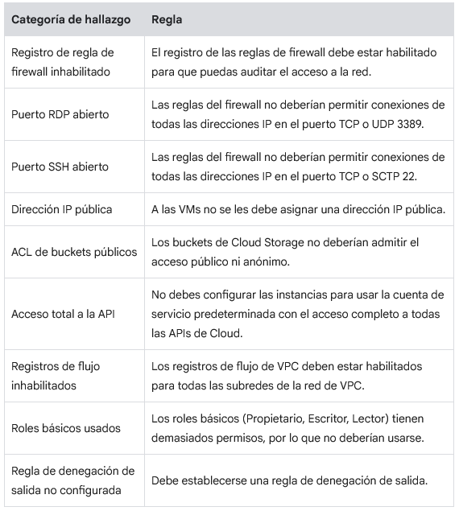

## Proyecto final Google Cloud Security

### Situación

Durante el último año, estuviste trabajando como analista júnior de seguridad en la nube en Cymbal Retail. Cymbal Retail es una potencia de mercado que actualmente opera en 170 tiendas físicas y una plataforma en línea en 28 países. En la empresa, se registraron $15,000 millones en ingresos en el 2022 y, hoy en día, tienen 80,400 empleados en todo el mundo.

Cymbal Retail posee una vasta base de clientes con una multitud de transacciones que ocurren diariamente en su plataforma en línea. La organización está comprometida con la seguridad y la protección de sus clientes, empleados y recursos, lo que permite garantizar que sus operaciones satisfagan las expectativas de cumplimiento de reglamentaciones internas y externas en todos los países en los que opera.

Recientemente, la empresa experimentó una violación masiva de la seguridad de los datos. Como miembro júnior del equipo de seguridad, ayudarás a ese equipo a través del ciclo de vida de este incidente de seguridad. Comenzarás identificando las vulnerabilidades relacionadas con la violación, la aislarás y contendrás para impedir el acceso no autorizado, recuperarás los sistemas comprometidos, solucionarás cualquier problema pendiente relacionado con la seguridad y verificarás el cumplimiento de los marcos de trabajo.

Así es cómo realizarás esta tarea: Primero, evaluarás las vulnerabilidades y hallazgos en Google Cloud Security Command Center. A continuación, apagarás la antigua VM y crearás una nueva a partir de una instantánea. Luego, evocarás el acceso público al bucket de almacenamiento y cambiarás al control de acceso uniforme a nivel del bucket. Después, limitarás el acceso a los puertos de firewall y ajustarás las reglas de este último. Finalmente, ejecutarás un informe para verificar la corrección de las vulnerabilidades.

### Tarea 1: Analiza la violación de la seguridad de los datos y recopila información

Una mañana, el equipo de seguridad detecta una actividad inusual en sus sistemas. Una mayor investigación de esta actividad rápidamente revela que la empresa sufrió una violación considerable de la seguridad en sus aplicaciones, redes, sistemas y repositorios de datos. Los atacantes obtuvieron acceso no autorizado a información sensible de clientes, incluidos datos personales y de tarjetas de crédito. Este incidente requiere atención inmediata y una investigación exhaustiva. El primer paso para comprender el impacto y alcance de la violación es recopilar información y analizar los datos disponibles.

En esta tarea, examinarás las vulnerabilidades y los hallazgos en Google Cloud Security Command Center para determinar cómo los atacantes obtuvieron acceso a los datos y qué pasos de corrección debes tomar.

***Importante: Las vulnerabilidades mencionadas en esta sección dependen de verificaciones de seguridad específicas que se realizaron anteriormente. Si aún no se han ejecutado algunas verificaciones, es posible que las vulnerabilidades relacionadas no aparezcan en Security Command Center cuando completes los pasos de esta sección. Sin embargo, no te preocupes. Todavía puedes usar la información proporcionada en esta tarea para analizar los hallazgos disponibles y proceder con los pasos de corrección en las tareas que siguen.***

Primero, navega a Security Command Center para ver una descripción general de las vulnerabilidades activas.

- En el **menú de navegación** de la consola de Google Cloud, haz clic en Seguridad > Resumen de riesgos. Se abrirá la página Descripción general de Security Command Center.
- En el panel **Parámetros de configuración incorrectos**, selecciona la pestaña Por tipo de recurso. Los hallazgos o las vulnerabilidades de seguridad basados en el tipo de recurso de nube afectado (p. ej., instancias, buckets, bases de datos) están organizados. Cuando revisas las vulnerabilidades y los hallazgos activos por tipo de recurso, puedes priorizar y abordar los problemas de seguridad con eficacia.

A continuación, navega al informe de PCI DSS.

- En el menú de **Security Command Center**, haz clic en Cumplimiento. Se abre la página Cumplimiento.
- En la sección **Google Cloud compliance standards**, haz clic en **View details** en la tarjeta PCI DSS 3.2.1. Se abre el informe de PCI DSS 3.2.1.
- Haz clic en la columna **Findings** para ordenarlos y mostrar los hallazgos activos en la parte superior de la lista.

***Nota: Asegúrate de seguir estos pasos para evaluar el informe de PCI y no actualices la página, ya que se quitarán los filtros requeridos y no se mostrará la información correcta.***

Las Normas de Seguridad de Datos de la Industria de Tarjetas de Pago (PCI DSS) son un conjunto de requisitos de seguridad que las organizaciones deben seguir para proteger los datos sensibles de los titulares de tarjetas. Como empresa minorista que acepta y procesa pagos con tarjetas de crédito, Cymbal Retail también debe asegurarse de cumplir con los requisitos de PCI DSS para proteger los datos de los titulares de tarjetas.

A medida que examinas el informe de PCI DSS 3.2.1, observa que en este se mencionan las reglas que no cumplen con los requisitos y que se relacionan con la violación de la seguridad de los datos. Por ejemplo:

- **El registro de las reglas de firewall debe estar habilitado para que puedas auditar el acceso a la red**: Este hallazgo de gravedad intermedia indica que el registro de las reglas de firewall está inhabilitado, lo que quiere decir que no hay registros de cuáles reglas de firewall se están aplicando ni de qué tráfico se permite o rechaza. Este es un riesgo de seguridad, ya que dificulta hacer un seguimiento y una investigación de la actividad sospechosa.
- **Las reglas del firewall no deberían permitir conexiones de todas las direcciones IP en el puerto TCP o UDP 3389**: Este hallazgo de gravedad alta indica que el firewall está configurado para permitir tráfico de protocolo de escritorio remoto (RDP) para todas las instancias en la red de todo Internet. Este es un riesgo de seguridad, ya que le permite a cualquier usuario en Internet conectarse al puerto de RDP en cualquier instancia de la red.
- **Las reglas del firewall no deberían permitir conexiones de todas las direcciones IP en el puerto TCP o SCTP 22**: Este hallazgo de gravedad alta indica que el firewall está configurado para permitir tráfico de Secure Shell (SSH) a todas las instancias en la red de todo Internet. SSH es un protocolo que permite el acceso remoto seguro a una computadora. Si un atacante puede obtener acceso a una máquina a través de SSH, potencialmente podría robar datos, instalar malware o interrumpir las operaciones.
- **A las VMs no se les debe asignar una dirección IP pública**: Este hallazgo de gravedad alta indica que una dirección IP particular está expuesta de manera activa al Internet público y es potencialmente accesible para las personas no autorizadas. Esto se considera un riesgo potencial de seguridad, ya que puede permitir que los atacantes busquen vulnerabilidades o lancen ataques en el recurso asociado.
- **Los buckets de Cloud Storage no deberían admitir el acceso público ni anónimo**: Este hallazgo de gravedad alta indica que hay una entrada de Lista de control de acceso (ACL) para el bucket de almacenamiento al que se puede acceder de forma pública, lo que significa que cualquier persona en Internet puede leer los archivos almacenados en él. Esta es una vulnerabilidad de seguridad de alto riesgo que requiere que se priorice para su corrección.
- **No debes configurar las instancias para usar la cuenta de servicio predeterminada con el acceso completo a todas las APIs de Cloud**: Este hallazgo de gravedad intermedia indica que a una identidad o cuenta de servicio particular se le otorgó acceso completo a todas las APIs de Google Cloud. Esto se considera un riesgo de seguridad significativo, ya que otorga a la identidad o cuenta de servicio la capacidad de realizar cualquier acción en el entorno de Google Cloud, lo que incluye acceder a datos sensibles, modificar parámetros de configuración y borrar recursos.

En la siguiente tabla, se asocian las reglas mencionadas en el informe con su categoría de hallazgo correspondiente. Esta te ayudará cuando examines los hallazgos según el tipo de recurso más adelante:

En general, estos hallazgos indican una falta fundamental de controles de seguridad y el incumplimiento de requisitos de PCI DSS esenciales. También apuntan a vulnerabilidades asociadas con la violación de la seguridad de los datos.

A continuación, navega al Security Command Center y filtra los hallazgos para examinar y analizar en profundidad las vulnerabilidades en el entorno de Google Cloud.

En la consola de Google Cloud, en el menú de navegación, haz clic en Seguridad > Resultados. Se abre la página Resultados.
En el panel Filtros rápidos, en la sección Tipo de recurso, selecciona la casilla de verificación para el tipo de recurso Bucket de Google Cloud Storage.

Deberían aparecer los siguientes hallazgos activos pertenecientes al bucket de almacenamiento:

- **ACL de buckets públicos**: Este hallazgo se menciona en el informe de PCI DSS y señala que cualquier persona con acceso a Internet puede leer los datos almacenados en el bucket.
- **Solo política del bucket inhabilitada**: Este indica que no hay una política de bucket explícita implementada para controlar quién puede acceder a los datos en él.
- **Registro de buckets inhabilitado**: Este indica que no hay un registro habilitado para el bucket, por lo que será difícil hacer un seguimiento de quién accede a los datos.

Estos hallazgos indican que el bucket está configurado con una combinación de parámetros de configuración de seguridad que podría exponer los datos al acceso no autorizado. Deberás corregir estos hallazgos quitando la lista de control de acceso público, inhabilitando el acceso público al bucket y habilitando la política de acceso uniforme a nivel del bucket.

En el panel Filtros rápidos, en la sección Tipo de recurso, desmarca Bucket de Google Cloud Storage y selecciona la casilla de verificación para el tipo de recurso Google compute instance.

Deben aparecer los siguientes hallazgos activos que pertenecen a la máquina virtual llamada ``cc-app-01``:

- **Dominio de software malicioso**: Este hallazgo indica que se accedió a un dominio conocido por asociarse con malware desde la google.compute.instance llamada ``cc-app-01``. Aunque este hallazgo se considera de gravedad baja, indica que ocurrió actividad maliciosa en la instancia de máquina virtual, por lo que está en riesgo.
- **Arranque seguro de Compute inhabilitado**: Este hallazgo de gravedad intermedia indica que el arranque seguro está inhabilitado para la máquina virtual. Este es un riesgo de seguridad, ya que permite que la máquina virtual se inicie con un código no autorizado, lo que podría usarse para comprometer el sistema.
- **Cuenta de servicio predeterminada usada**: Este hallazgo de gravedad intermedia indica que la máquina virtual está usando la cuenta de servicio predeterminada. Este es un riesgo de seguridad, ya que esta cuenta tiene un alto nivel de acceso y podría verse comprometida si un atacante obtiene acceso al proyecto.
- **Dirección IP pública**: Este hallazgo de gravedad alta se menciona en el informe de PCI DSS y señala que la máquina virtual tiene una dirección IP pública. Este es un riesgo de seguridad, ya que permite que cualquier persona en Internet se conecte a la máquina virtual directamente.
- **Acceso total a la API**: Este hallazgo de gravedad intermedia se menciona en el informe de PCI DSS y señala que a la máquina virtual se le otorgó acceso total a las APIs de Google Cloud.

Estos hallazgos indican que la máquina virtual se configuró de manera que la dejó muy vulnerable al ataque. Para corregirlos, deberás apagar la VM original (cc-app-01) y crear una VM (cc-app-02) usando una instantánea limpia del disco. La nueva VM tendrá la siguiente configuración aplicada:

- Sin cuenta de servicio de procesamiento
- Etiqueta de regla de firewall para una regla nueva para el acceso SSH controlado
- Arranque seguro habilitado
- Dirección IP pública configurada en Ninguna

En el campo Intervalo de tiempo, expande el menú desplegable y selecciona Últimos 30 días. Así, garantizarás que la lista incluya los hallazgos de los últimos 30 días.

En el panel Filtros rápidos, en la sección Tipo de recurso, desmarca Google compute instance y selecciona la casilla de verificación para el tipo de recurso Google compute firewall.

Los siguientes hallazgos activos deben mencionarse como pertenecientes al firewall:

- **Puerto SSH abierto**: Este hallazgo de gravedad alta indica que el firewall está configurado para permitir tráfico de Secure Shell (SSH) a todas las instancias en la red de todo Internet.
- **Puerto RDP abierto**: Este hallazgo de gravedad alta indica que el firewall está configurado para permitir tráfico de protocolo de escritorio remoto (RDP) para todas las instancias en la red de todo Internet.
- **Registro de regla de firewall inhabilitado**: Este hallazgo de gravedad intermedia indica que el registro de las reglas de firewall está inhabilitado. Esto significa que no hay registro de cuáles reglas de firewall se están aplicando ni de qué tráfico se permite o rechaza.

Todos estos hallazgos se mencionan en el informe de PCI DSS y destacan una brecha de seguridad significativa en la configuración de la red. La falta de acceso restringido a los puertos RDP o SSH, en conjunto con el registro de regla de firewall inhabilitado, hace que la red sea altamente vulnerable a intentos de acceso no autorizado y potenciales violaciones de la seguridad de los datos. Para corregir estos hallazgos, debes quitar las reglas demasiado generales del firewall existente y reemplazarlas por una regla de firewall que permita el acceso SSH solo de direcciones que usa el servicio de SSH de IAP de Google Cloud.

Ahora que analizaste las vulnerabilidades de seguridad, es momento de trabajar en corregir los hallazgos del informe.